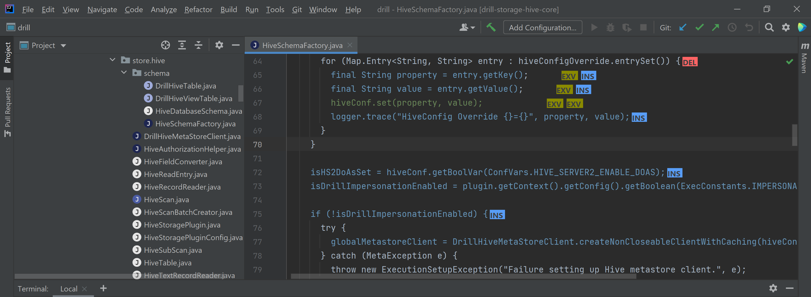

# Code changes plugin

## Description
This plugin for IntelliJ IDEA highlights the code of a Java project based on the changes made on the current commit. It also adds visual elements that, when you hover on them, they show a popup with additional information. Some of those visual elements have click actions. This plugin also overrides the icons of the IntelliJ IDEA file explorer to show with colors on the icons the amount of changes of each file.

You can find a more detailed documentation and a video demo/tutorial (a bit outdated though) on [this folder](https://github.com/ronaldescobarj/highlight-plugin-poc/tree/main/files).

## Themes

On the main branch, this plugin by default works for dark theme. It also works on light theme, but there are some issues with specific colors. The code working for light theme is on the branch [light-theme](https://github.com/ronaldescobarj/highlight-plugin-poc/tree/light-theme).

## How to run

From IntelliJ IDEA, click on the Gradle side menu at the right, and on tasks, look for intellij folder and double click on "runIde" task.

## How to build

It is almost same procedure as for running, but instead of the "runIde" task, on the same gradle tasks intellij folder, double click on "buildPlugin". If the build succeeded, it will be located in build/distributions folder starting from the root of the project.

## Download installer

In case you don't want to manually build the plugin, you can download the dark theme and/or the light theme installer from [this folder](https://github.com/ronaldescobarj/highlight-plugin-poc/tree/main/installers).

To install, you can refer to [this guide](https://github.com/ronaldescobarj/highlight-plugin-poc/blob/main/INSTALL.md), which covers everything since installing the right IntelliJ idea version to installing the plugin.

## How to reproduce results in the paper

Following the [installation guide](https://github.com/ronaldescobarj/highlight-plugin-poc/blob/main/INSTALL.md) you should be able to reproduce results on the paper. The installation guide uses Apache Giraph as an example, but the same applies to Apache Drill and Apache Commons IO.
