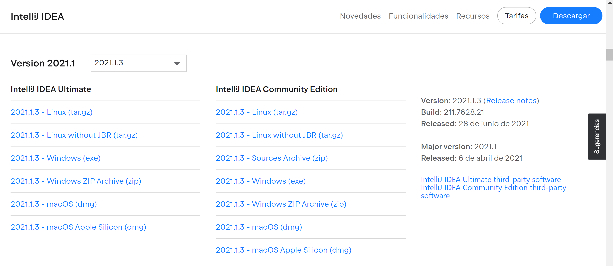
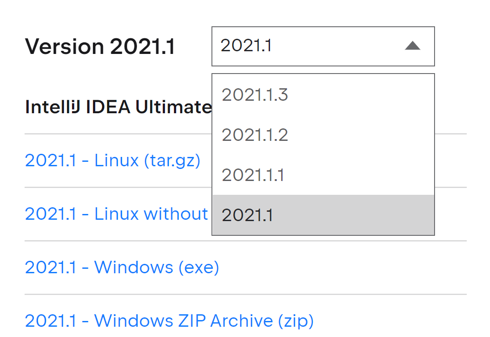
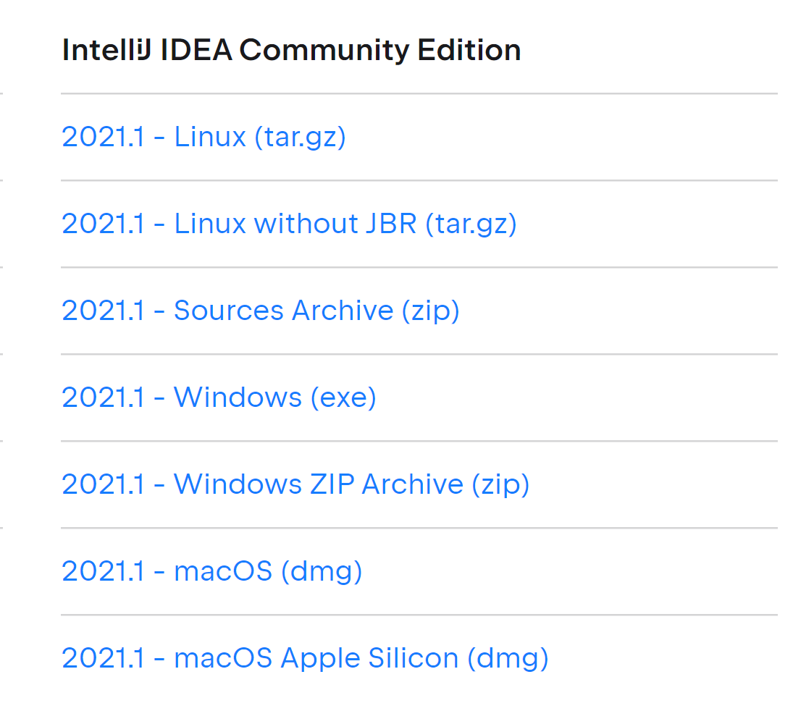

# Tutorial

This tutorial explains how to load the projects with the specific commits in order to replicate the examples, and load the plugin in order to have the tool working on those examples.

The repositories used on the main experiment are [Apache Drill](http://github.com/apache/drill) and [Apache Giraph](http://github.com/apache/giraph), and the repository used on the pilot is [Apache Commons IO](https://github.com/apache/commons-io). The commits are:

- Apache Drill commit [c1b847](https://github.com/apache/drill/commit/c1b847acdc8cb90a1498b236b3bb5c81ca75c044)
- Apache Giraph commit [03ade](https://github.com/apache/giraph/commit/03ade425dd5a65d3a713d5e7d85aa7605956fbd2)
- Apache Commons IO Commit [4a514](https://github.com/apache/commons-io/commit/4a514d3306b55b3667d1449ebd4cbe5f19dd7af0)
## Steps
On the following steps we are going to use Apache Giraph's commit, but the same steps apply for the Drill and Commons IO commits:

The experiment has been made with IntelliJ IDEA 2021.1. There have been problems trying to build for the latest IntelliJ IDEA version, but using the 2021.1 version works and it will also replicate with the exact version the participants used on the experiment.

#### 1. Download IntelliJ IDEA 2021.1
If you're using Windows, you can directly click into [this link](https://download.jetbrains.com/idea/ideaIC-2021.1.exe?_gl=1*7niu09*_ga*MTU5NjE1NzI0Ny4xNjM4MzI2NjE1*_ga_9J976DJZ68*MTY2MDcwMzg0NS4xMi4wLjE2NjA3MDM4NDUuMC4wLjA.&_ga=2.16027126.1302933131.1660703846-1596157247.1638326615) and your download of IntelliJ IDEA 2021.1 will start automatically. Or you can follow these steps:
1. Open this link https://www.jetbrains.com/es-es/idea/download/other.html
2. Scroll down until finding "Version 2021.1"

3. Click on the dropdown box and select "2021.1"

4. Click on one of the options according to your opoerative system. The download will start automatically

5. Once the download finishes, run the installer and follow the steps to install IntelliJ 2021.1 (The wizard/steps/configuration may vary between operative systems.)
#### 2. Clone Apache Giraph repository
git clone https://github.com/apache/giraph.git
#### 3. Open the IntelliJ IDEA 2021.1 that was just installed on step 1
#### 4. Open Apache Giraph from IntelliJ IDEA
1. Click on File -> Open
2. Select the folder where you cloned apache giraph
3. Execute git checkout 03ade425dd5a65d3a713d5e7d85aa7605956fbd2
#### 5. Download and install the plugin
6. Download the plugin from here https://drive.google.com/drive/folders/1BonHAqqSyg-y0ldaf2NMcShrtm6cMois keep in mind a couple of things:
   - There are different installers for both light theme and dark theme.
   - Do not unzip the installer, since the plugin will be installed as a whole zip.
7. Click on File -> Settings
8. Click on "Plugins" on the side menu on the left.
9. Click on the little gear icon at the top right and select "Install Plugin From Disk...".
10. Select the location of the zip of the plugin (whether you builded it manually or downloaded it).
11. Press OK.
12. Restart the IDE.